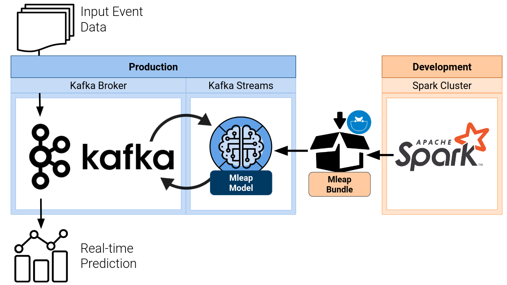

# kafka-mleap-iris-classifier



A Kafka Streams Application embedding a Spark ML pipeline with the help of Mleap

## Development

1. Download the Iris data with `make raw-data`
2. Create a model using Jupyter
    1. start Jupyter with `docker-compose up jupyter`
    2. use the notebook called __Iris__ to train a Spark ML pipeline model and save it as a MLeap bundle
    3. optionally replace the existing Mleap bundle in the Scala resource folders `src/main/resources` and `src/test/resources`
3. Compile the Kafka streaming application with `make sbt-assembly`

## Running Locally

1. start the Kafka broker with `docker-compose up kafka`
2. create the required Kafka topics:
```
docker-compose exec kafka kafka-topics.sh --create --bootstrap-server kafka:9092 --replication-factor 1 --partitions 1 --topic iris-classifier-input
docker-compose exec kafka kafka-topics.sh --create --bootstrap-server kafka:9092 --replication-factor 1 --partitions 1 --topic iris-classifier-output
```
3. start the streaming application as an external Kafka client from your host machine with 
```
java -classpath target/scala-2.12/iris-classifier-streams-assembly-1.0.0.jar  kafka.iris.IrisStreamClassifier localhost:29092
```
4. create a console consumer to print model output messages to the terminal with
```
docker-compose exec kafka kafka-console-consumer.sh --bootstrap-server kafka:9092 --topic iris-classifier-output --max-messages 1
```
5. post an input message with
```
docker-compose exec kafka bash -c "echo 5.1,3.5,1.4,0.2 | kafka-console-producer.sh --broker-list kafka:9092 --topic iris-classifier-input && echo"
```
6. You should see the model output printed to your terminal by the console consumer from the previous step

